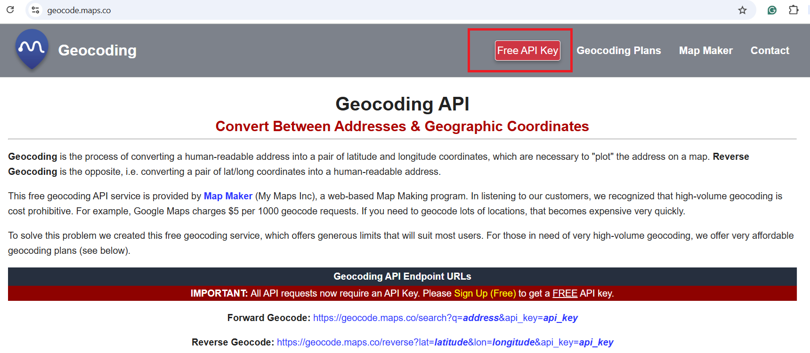
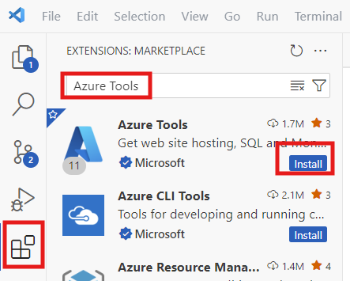
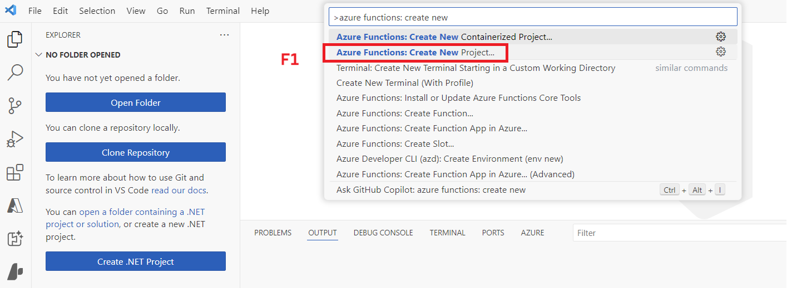
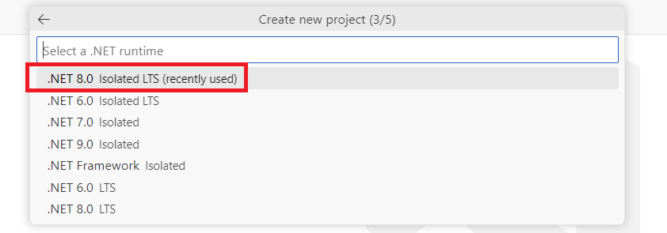
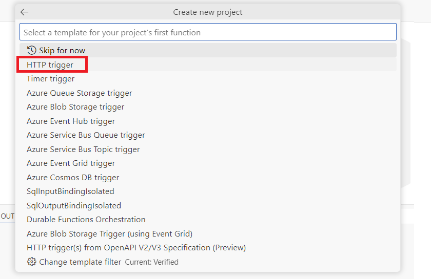
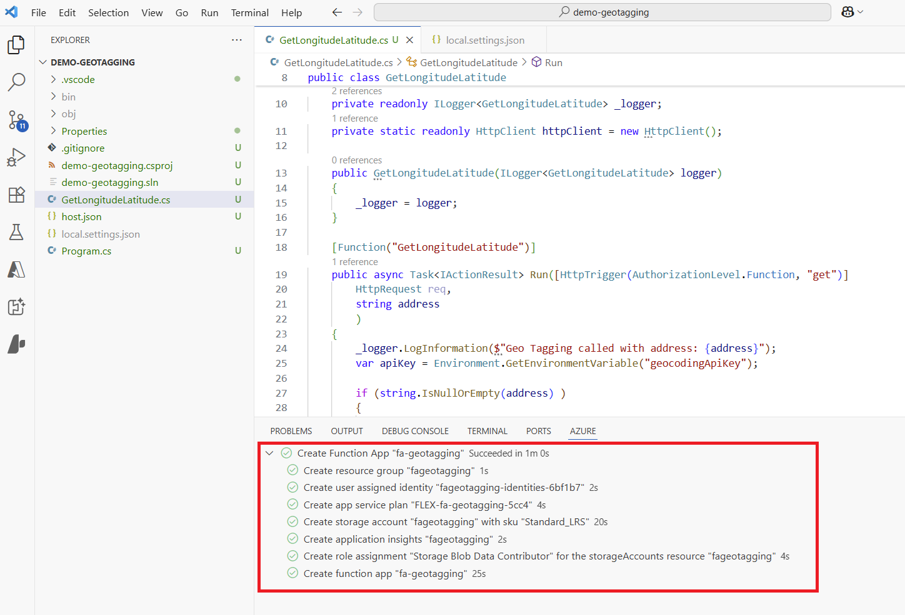
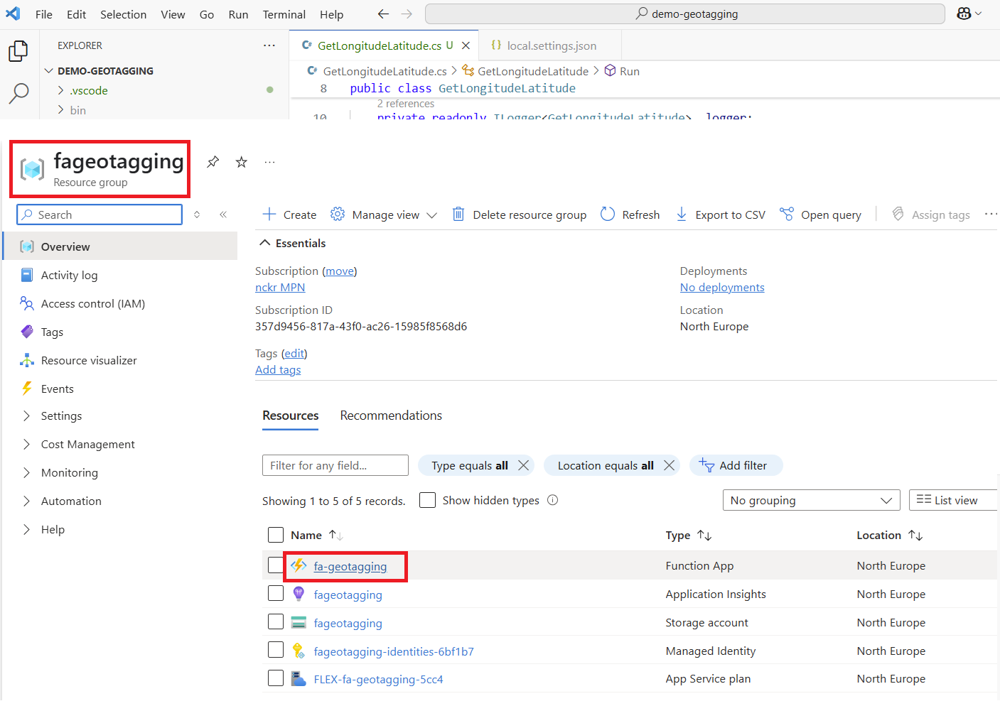
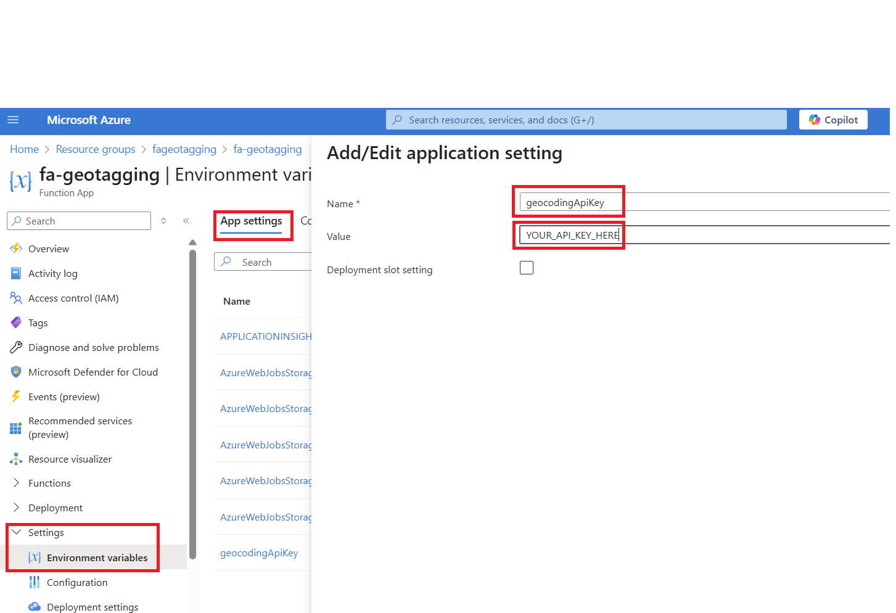
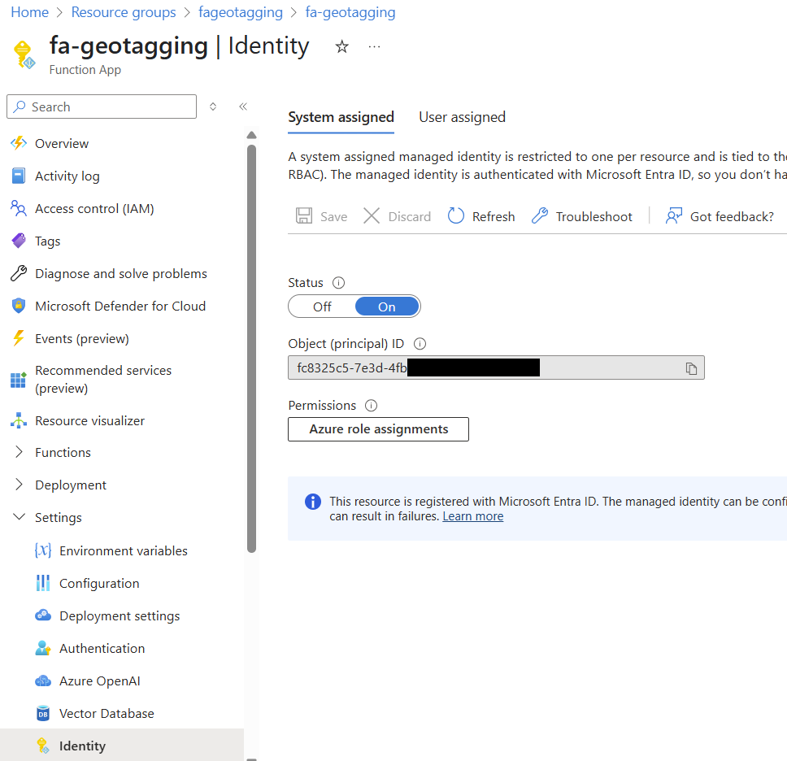
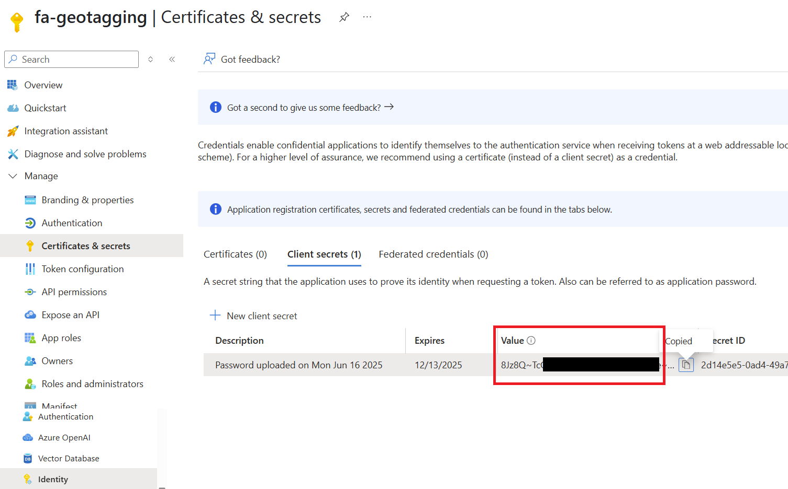

# Lab 02 - Azure Functions & Dataverse

In this lab, you will go through the following tasks:

* Create and Publish an Azure Function App
* Create HTTP Azure Function connecting to external API
* Authenticate with Dataverse in your Azure Function (either Managed Identity or Connection String)

## Scenario
In this case we want to build a geo tagging function, that automatically updates the longitude and latitude of contacts when they are created with an address. The Azure Function shall later be called async via Power Automate, do all the logic in the Azure Function and update the contact record via Managed Identity Authentication. The advantage of this setup is, that you can have a potential time consuming external API call outsource and managed, while still having the ability to add all the custom logic to it.

For the GeoTagging we will use a free API service called **Geocoding API**, you can sign up for a free API key here https://geocode.maps.co/ click on **Free API Key** and create an account. After you verified  your email they will send you your personal free API Key.


Save this API key, we will need it in Task 3!

## Pre-Requisites
- Azure Subscription
-- Start your free trial here: https://azure.microsoft.com/en-us/pricing/purchase-options/azure-account 
- Visual Studio Code
- XrmToolBox (Download and install: https://www.xrmtoolbox.com/)

## Visual Studio Code Project
If you don't want to create the Visual Studio Code project or have trouble creating it you can find the finished version in this repository https://github.com/mnecker/demo-geotagging 

## Task 0: Prepare Visual Studio Code
In order to develop Azure Functions in Visual Studio Code we need to install a few extensions to make our lives easier. Open **Visual Studio Code**

### Azure Functions Core Tools
Go to https://learn.microsoft.com/en-us/azure/azure-functions/functions-run-local?tabs=windows%2Cisolated-process%2Cnode-v4%2Cpython-v2%2Chttp-trigger%2Ccontainer-apps&pivots=programming-language-csharp#install-the-azure-functions-core-tools and download the **Azure Functions Core Tools**. These are required to debug Azure Functions locally. After the download is completed execute the installer and follow it's instructions.

While the download and installation is running you can continue with the next steps.

### Azure Tools Extension for Visual Studio Code
Go to **Extensions** search for **Azure Tools** and click install. Azure Tools provides a rich set of extensions that make it easy to discover and interact with the cloud services that power your applications.



### C# Extension for Visual Studio Code 
Go to **Extensions** search for **C# Dev Kit** and click install which will add support for C# to Visual Studio Code. You can also create Azure Functions in other programming languages, but the examples in this lab will use


**Important** After installing all pre-requisites (especially Azure Functions Core Tools) close all instances of Visual Studio Code and start it again. Otherwise some extension will not be loaded correctly.


## Task 1: Create an Azure Function App
In this task we will use Visual Studio Code to create an Azure Function and publish it to your Azure Subscription. Use an empty window in Visual Studio Code or open a new one.

We are going to create an Azure Function which can be triggered by an HTTP call.

* Press **F1** to open the command bar and search for **Azure Functions: Create new Project** and press enter


* Select or create an empty folder where you want to store your project.

* In the next dialog screen select **C#** as language and press enter


* In the next dialog screen select **.NET 8.0 Isolated LTS** as .NET Framework version and press enter


* In the next dialog screen select **HttpTrigger** as Azure Function template name and press enter


* In the next dialog screen enter **GetLongitudeLatitude** as function name and press enter


* Enter a namespace of your choosing for example **Demo.Workshop**

* In the next dialog screen select **Function** for authentication of the Azure Function and press enter


* Select **Open in current window** and press enter to start the creation of the Azure Functions project.

* If you followed these steps your Visual Studio Code window with the opened project will look like this:


## Task 2: Test Azure Function locally
To test if all pre-requisites  are installed correctly we want to run the created Azure Function. It doesn't do anything useful, but the template created a working Function which will simply return a string.

Open the Azure Function file **GetLongitudeLatitude.cs** and press **F5** to start the build & debug process. This will first build the project and then start a local Azure Functions runtime and run the Function in it. You can follow the progress in the terminal window of Visual Studio Code. If everything is successful, it will display the localhost url where the Function can be triggered:


If you want to create breakpoint where code execution will be halted during debugging, select a line and press **F9**. 

### Trigger the local Azure Function
In order to test our local Azure Function we need to call the http URL which is displayed in the terminal. There are multiple tools which can do that like **Postman**. If you have experience with this other similar tools use them. But since we created a simple HTTP GET Function, the most simple way to test it is your browser. Open a new window and enter the url to trigger the function. By default the url should be **http://localhost:7071/api/GetLongitudeLatitude** but it could be different on your machine so check the terminal output.


If you see the text **Welcome to Azure Functions!** your function was successfully executed. If you set a breakpoint early you need to go to Visual Studio Code and continue the code execution.

If you want to stop your debugging / running the function locally, select the terminal and press **Ctrl + C**. If you close it in any other way, the process might still be running locally and the next time you try to debug you will run into errors.

## Task 3: Connect to external API
The API we want to call needs to parameters to return the longitude and latitude of an address:
* **q** the address itself
* **api_key** your personal api key for authentication

The address parameter we want to keep dynamic, because that will change with each execution of the function. But the API key we want to keep secure and since it's always the same it should not be sent with every request. So we will do two different approaches for these two parameters.

### Address parameter
This parameter will be added as an query parameter to the Azure Function, so that it can be called easily via the url. For this we need to change the code in the file **GetLongitudeLatitude.cs**, overwrite the **[Function("GetLongitudeLatitude")]** with the following.

```
[Function("GetLongitudeLatitude")]
    public IActionResult Run([HttpTrigger(AuthorizationLevel.Function, "get")]
        HttpRequest req,
        string address
        )
    {
        _logger.LogInformation($"Geo Tagging called with address: {address}");
        return new OkObjectResult(address);
    }
```


You can see that the parameter **address** was added and that we can use it now in the code. At the moment, the address is just logged to the console and returned to the caller. Change your code and test it, if you call your function with a parameter address like this **http://localhost:7071/api/GetLongitudeLatitude?address=Bruno-Kreisky-Platz%205,%201220%20Wien** the result should look like this:


Noticed that we you test your function in the browser, the browser will automatically URL decode the parameter.

### API Key
The API Key we want to store in the Azure Function, there are multiple ways to do this, in this example we will use the Application Settings. **This is not recommend for production use cases where you want to secure your secrets better**.

Open the file **local.settings.json** and add a new value under **values** called **geocodingApiKey** with your api key like in this example (replace **YOUR_API_KEY_HERE** with your api key):


The url we need to call for the api is **https://geocode.maps.co/search?q=address&api_key=api_key** 

**Challenge** implement this code in your Azure Function yourself! (Or via Copilot)

<details>
<summary>Code Solution for Copy & Paste</summary>
    public async Task<IActionResult> Run([HttpTrigger(AuthorizationLevel.Function, "get")]
        HttpRequest req,
        string address
        )
    {
        _logger.LogInformation($"Geo Tagging called with address: {address}");
        var apiKey = Environment.GetEnvironmentVariable("geocodingApiKey");

        if (string.IsNullOrEmpty(address) )
        {
            return new BadRequestObjectResult("Please provide 'address' as query parameter");
        }
    
        string url = $"https://geocode.maps.co/search?api_key={apiKey}&q={System.Net.WebUtility.UrlEncode(address)}";
    
        HttpResponseMessage response = await httpClient.GetAsync(url);
    
        if (!response.IsSuccessStatusCode)
        {
            return new StatusCodeResult((int)response.StatusCode);
        }
    
        string jsonResult = await response.Content.ReadAsStringAsync();
        return new ContentResult
        {
            Content = jsonResult,
            ContentType = "application/json",
            StatusCode = 200
        };
    }  


</details>

  

If successfully implemented your function will now return a JSON which includes the longitude and latitude of the entered address:


## Task 4: Publish Azure Function to Azure
After testing the function successfully locally we want to publish to Azure next to make it available.

* Press **F1** in Visual Studio Code and search for **Azure Functions: Create Function App in Azure**

* Select **Sign In Azure** and follow the login process. Do log in with your account which has access to an Azure Subscription

* After successful sign in select your subscription in the next step

* In the next step enter a **Name** for your function app, for example **fa-geotagging** and press enter 

* In the next step select a **Region** where you Azure Function will be hosted, for example **North Europe**

* In the next step select **.NET 8 Isolated** as .NET runtime stack 

* In the next step select **Managed Identity** as authentication for resource authentication type

Wait till the creation process is finished, you can follow the progress in the terminal.


After this step we only have create the resources for the Azure Function in Azure, but have **not yet deployed the actual code/functions!**. For this we need one more step:

* Press **F1** in Visual Studio Code and search for **Azure Functions: Deploy to Functions App**

* In the next step select the same subscription as in the step before and press enter

* In the next step select your deployed Azure Function (fa-geotagging if you followed the naming) and press enter

* Confirm the deployment and wait for the success log in the terminal


If the deployment was successful log in the Azure Portal https://portal.azure.com/ and open your newly created Azure Function. Navigate to your **Resource Groups** and open the one with the auto-generated name from the terminal from the previous step:
 and open the Azure Function.

In your Azure Function open **Settings** and **Environment Variables**. We also need to add our API Key here, because the **local.settings.json** is never deployed to Azure and only works locally. To create a new **App Setting** click **Add** and enter the same values as from you local.settings.json:


Press **Apply** and **Confirm** to save the changes.

Let's test it! To find out the URL for your deployed Function navigate to **Overview** and select your function. In the new window click on **Get Function url** and copy the value from **default (Function Key)** 


Test the url the same way in a new browser window. Be aware that there is already a query parameter called **code** for the authentication, add the address parameter like this at the end of the url: **&address=Bruno-Kreisky-Platz%201,%201220%20Wien**  

If successful you should see the same JSON as you did before!

## Task 5: Extend Function to update a contact
In order to write the longitude and latitude back to Dataverse, we need to know which contact to update. For this reason we add a new query parameter like the address parameter called **contactguid**.


For the communicating with Dataverse we also need to add the Dataverse SDK to our project:

* Press **F1** in Visual Studio Code and search for **NuGet: Add NuGet Package** and press enter

* Search for **Microsoft.PowerPlatform.Dataverse.Client** and press enter, select it and select the latest version and press enter

The SDK is now being installed and can be used in the project.

For the authentication we will add a small wrapper for the **ServiceClient** class which is provided by the SDK. The wrapper **DataverseClient** will utilize the **Managed Identity** feature.

Add the file **DataverseClient.cs** with the following content to your project:
```
using Azure.Core;
using Azure.Identity;
using Microsoft.Extensions.Logging;
using Microsoft.PowerPlatform.Dataverse.Client;

namespace Demo
{
	public class DataverseClient
	{
		public ServiceClient client;
		private readonly ILogger _logger;

		public DataverseClient(
			ILogger logger
			)
		{
			_logger = logger;
		}

		public void InitializeDefault(string environmentUrl)
		{
			try
			{
				InitializeManagedIdentity(environmentUrl);

				if (!client.IsReady) throw new Exception("Authentication Failed! - Client not ready");
			}
			catch (Exception ex)
			{
				_logger.LogError(ex.Message);
			}
		}

		public void InitializeManagedIdentity(string environmentUrl)
		{
			var tokenCredential = new DefaultAzureCredential();

			client = new ServiceClient(
				new Uri(environmentUrl),
				async (string dataverseUri) =>
				{
					dataverseUri = new Uri(dataverseUri).GetComponents(UriComponents.SchemeAndServer, UriFormat.UriEscaped);
					return (await tokenCredential.GetTokenAsync(new TokenRequestContext(new[] { dataverseUri }), default)).Token;
				},
				true);
		}	

        public void InitializeConnectionString(string connectionString)
        {
            client = new ServiceClient(connectionString);
        }	
	}
}
```


### Managed Identity - ONLY WORKS WHEN DATAVERSE AND AZURE FUNCTION ARE IN THE SAME TENANT
**Be aware** one current disadvantage of Managed Identities is, that they only work within one Microsoft Entra Id tenant. That means it can only authenticate an Azure Function with Dataverse if both are connected to the same Microsoft Entra Id tenant. The simple way to check this is if you login with the same domain to both. But if you are using a test / dev tenant for one of them, you can not use Managed Identity. **In this case skip this section and jump to the next which will show the connection via Connection String**.

As you can see in the function **InitializeManagedIdentity** we will need the environment url of dataverse as a parameter. This will again be stored in the application settings like the geocoding api key. Add the entry **dataverseUrl** to your local.settings.json and in the **Azure Portal** in the environment settings of your Azure Function. The Dataverse url needs to be in the following format: **https://communitydemo.crm4.dynamics.com/** 

Now we only need to add the code to update the contact. 

**Challenge** Update the function "GetLongitudeLatitude" so that it will update the fields  contact using the DataverseClient.

Here is one vibecoded version of it ;)
```
public async Task<IActionResult> Run([HttpTrigger(AuthorizationLevel.Function, "get")]
        HttpRequest req,
        string address,
        string contactguid
        )
    {
        _logger.LogInformation($"Geo Tagging called with address: {address}");
        var apiKey = Environment.GetEnvironmentVariable("geocodingApiKey");

        if (string.IsNullOrEmpty(address) )
        {
            return new BadRequestObjectResult("Please provide 'address' as query parameter");
        }

        string url = $"https://geocode.maps.co/search?api_key={apiKey}&q={System.Net.WebUtility.UrlEncode(address)}";

        HttpResponseMessage response = await httpClient.GetAsync(url);

        if (!response.IsSuccessStatusCode)
        {
            return new StatusCodeResult((int)response.StatusCode);
        }

        string jsonResult = await response.Content.ReadAsStringAsync();

        // Parse the JSON string into a JsonDocument
        using var doc = JsonDocument.Parse(jsonResult);

        // Get the first element in the array
        var firstItem = doc.RootElement[0];

        // Extract "lat" and "lon" as strings
        string lat = firstItem.GetProperty("lat").GetString();
        string lon = firstItem.GetProperty("lon").GetString();
        double latValue = double.Parse(lat);
        double lonValue = double.Parse(lon);

        try
        {
            DataverseClient dataverseClient = new DataverseClient(_logger);
            //dataverseClient.InitializeManagedIdentity(Environment.GetEnvironmentVariable("dataverseUrl"));
            //dataverseClient.InitializeConnectionString(Environment.GetEnvironmentVariable("dataverseConnectionString"));

            Entity contact = new Entity("contact", Guid.Parse(contactguid));
            contact["address1_latitude"] = latValue;
            contact["address1_longitude"] = lonValue;
            await dataverseClient.client.UpdateAsync(contact);
        }
        catch (Exception ex)
        {
            _logger.LogError($"Error: {ex.Message}");
            return new BadRequestObjectResult("Error parsing latitude and longitude");
        }
        

        return new ContentResult
        {
            Content = jsonResult,
            ContentType = "application/json",
            StatusCode = 200
        };
    }
```

Uncomment the **dataverseClient.InitializeManagedIdentity(Environment.GetEnvironmentVariable("dataverseUrl"));** line if you want to use Managed Identity for the connection with Dataverse.

here 

* Deploy changes again

* Add **datavereUrl** in Azure Portal as Application Setting

* In the Azure Portal in the Azure Function navigate under **Settings** to **Identity** and in the tab **System-Assigned** set the status to **On**


* Copy the **Object (principal) id** and navigate in the Azure Portal to **Microsoft Entra Id** https://portal.azure.com/#view/Microsoft_AAD_IAM/ActiveDirectoryMenuBlade/~/Overview

* In **Microsoft Entra Id** navigate to **Manage** / **Enterprise Application** and search with the **Object Id** copied from the Azure Function. You should find an application called **fa-geotagging** click on it and copy the **Application Id**

* Switch to Power Platform Admin Center and go to **Environments** https://admin.powerplatform.microsoft.com/manage/environments 

* Select your Dataverse Environment, and click on **S2S Apps** and **App App User** here you have to search with the **Application Id** (nor the Object Id or Name work!)

### Connection String
Use Connection String as authentication if Managed Identities are not available. See the code example in the previous section and copy it to your project. Uncomment the line **dataverseClient.InitializeConnectionString(Environment.GetEnvironmentVariable("dataverseConnectionString"));** to use the Connection String to authenticate.

To create a connection string for Dataverse go to **Microsoft Entra Id** in the tenant in which your Dataverse environment is. Use this link to go the **Application Registrations** in Entra Id https://portal.azure.com/#view/Microsoft_AAD_IAM/ActiveDirectoryMenuBlade/~/RegisteredApps 

* Click on **Create New Application**

* Give it a name, it should be clear that the Azure Function is using it, you can use the same name **fa-geotagging**. You can leave the other settings on their default values and click on **Register**

* Copy the **Application Id** 

* Navigate to **Certificates & Secrets** and click on **New client secret**

* Click on **Add** and copy the **Value** of the secret


* Go back to your Azure Function and in the **Environments Variable** section create a new **Application Setting** with the name **dataverseConnectionString** - The value has to be in the following format:

**AuthType=ClientSecret;url={DataverseUrl};ClientId={AppId};ClientSecret={ClientSecret}**

* Switch to Power Platform Admin Center and go to **Environments** https://admin.powerplatform.microsoft.com/manage/environments 

* Select your Dataverse Environment, and click on **S2S Apps** and click on **Add App User**

* Select the Application Registration we just created, assign it a business unit and appropriate security roles. 

And we are ready to test again! Call your Function with the Address and ContactGuid of an existing contact and check the result. By default the longitude / latitude field are not displayed on the contact form so you can either:
* Customize the Contact Form to this display them
* Using a tool like **LevelUp** to check the data for a record using **All Fields**:


## Bonus Task 1: Create a Custom Connector for your Azure Function
In order to call the Azure Function from Power Automate it's best to wrap it in a Custom Connector like we learned in Lab 2. Can you do this for your new function?

## Bonus Task 2: Create a Power Automate Flow that triggers the Custom Connector
Automate the process by building a Power Automate Flow that triggers on change of a contact address field, and calls the Custom Connector with the changed address and contact guid for it to update Longitude and Latitude.


