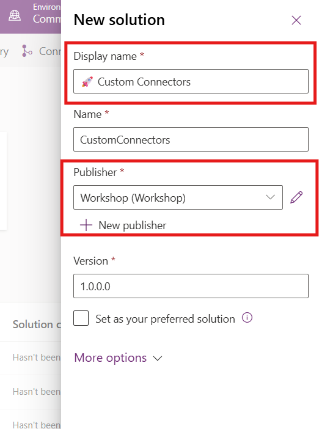
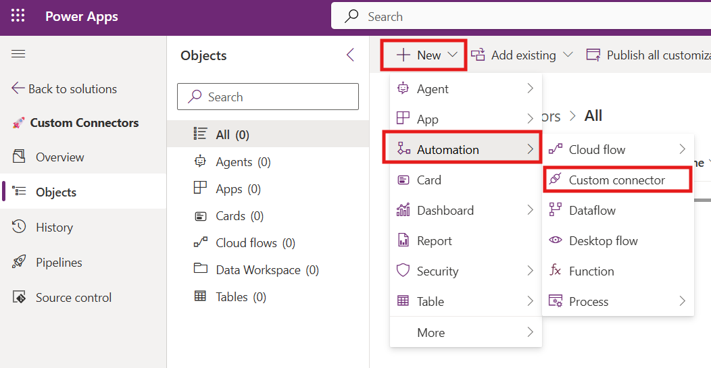
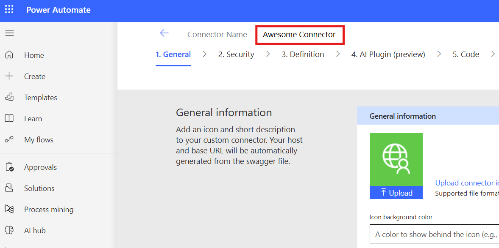
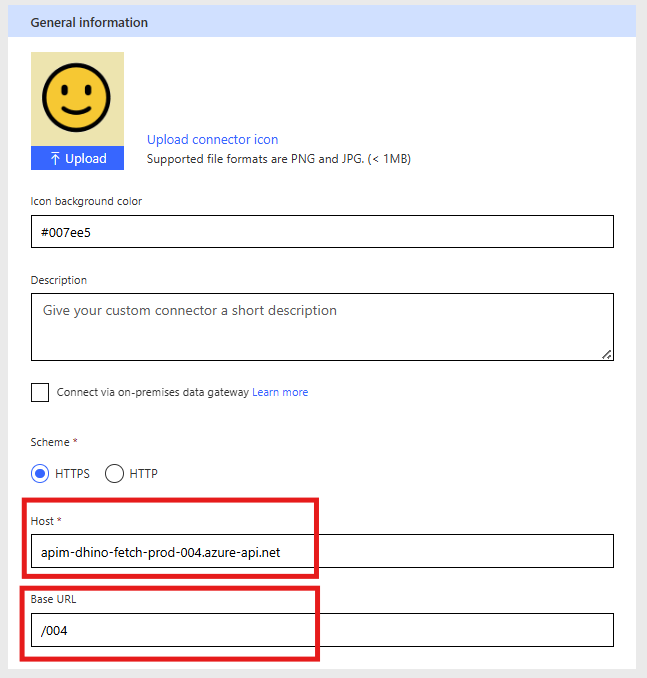

# Lab 02 - Custom Connectors / Azure Functions

In this lab, you will go through the following tasks:

* Create a solution
* Create a connector in the solution
* Setup authentication
* Add operation with Parameters

## Task 1: Create a solution
Best Practice for everything in the Power Platform: Work INSIDE solutions. They are great for organizing your customizations and some features only work here plus they over ALM capabilities.

Because of that our first step withing **make.powerautomate.com** is to navigate to **Solutions** on the left hand side and click on **New Solution**

In the dialog which open give your solution a meaningful name and select either create an own publisher by clicking **New** or use the **Default Publisher** named after your environment.

Sidenote: Using the Default Publisher is not considered best practice because you have no control about the technical prefix all your components will receive.

Congrats you have a solution for doing our Custom Connector development! Every journey starts with the first step 💪

## Task 2: Create a connector from blank
As we learned before there are multiple ways to create a Custom Connector, we will use the most basic one to learn the basics 🙂

Inside your solution click on **New** and in the menu on **Automation** and then on **Custom Connector**

### General Definition
In a new tab the Custom Connector edit wizard will be opened in the first step.

First step is given your Custom Connector a meaningful name, make sure to use a name your users will understand, this will show up in all UIs. Bonus points if you also add an icon below under **General Information**

Next you need to select **HTTPS** and fill in the **Host** and **Base URL**. The Nordic Summit event API can be reached under the following url:

**https://apim-dhino-fetch-test.azure-api.net/001**

